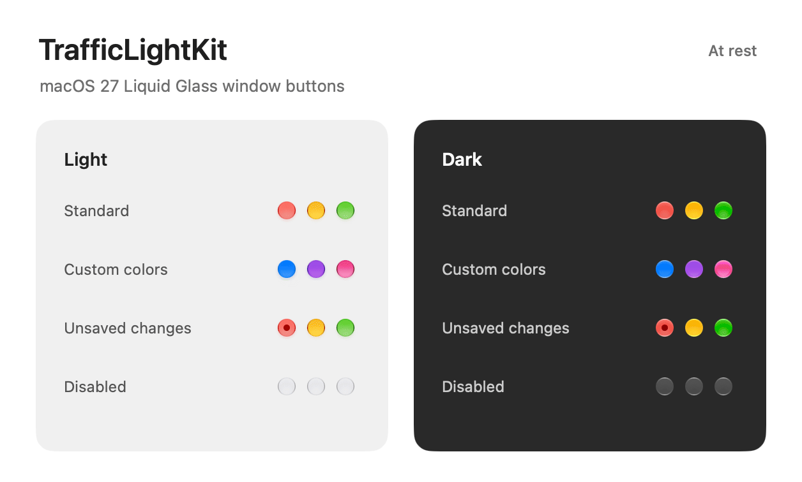

# TrafficLightKit

TrafficLightKit recreates the red, yellow, and green window buttons from **macOS 27’s Liquid Glass design** in SwiftUI. Use the standard colors or supply your own.

Requires **macOS 27 or later** and **Swift 6.4 / Xcode 27**. The appearance specifically targets macOS 27.



## Install

In Xcode, choose **File → Add Package Dependencies**, enter `https://github.com/jstw8/TrafficLightKit`, and add **TrafficLightKit** to your app target. For a local checkout, choose **Add Local** instead.

To use it from another Swift package, add `.package(path: "../TrafficLightKit")` to your package dependencies and `"TrafficLightKit"` to your target dependencies.

## Add the buttons

```swift
import SwiftUI
import TrafficLightKit

struct WindowButtons: View {
    let closeWindow: () -> Void
    let minimizeWindow: () -> Void
    let zoomWindow: () -> Void

    var body: some View {
        TrafficLightGroup {
            TrafficLightButton(.close, action: closeWindow)
            TrafficLightButton(.minimize, action: minimizeWindow)
            TrafficLightButton(.zoom, action: zoomWindow)
        }
    }
}
```

Put `WindowButtons` in your window header. `TrafficLightGroup` provides the usual button spacing and shared hover behavior. The buttons automatically update when their window gains or loses focus. An AppKit app can put the same SwiftUI view in an `NSHostingView`.

You provide every action. The library does not close, minimize, resize, move, zoom, or full-screen a window on its own. The green button's window-management menu is not included. Holding Option changes the green button’s symbol; your action decides what that means.

## Customize

```swift
TrafficLightButton(.close, tint: .purple, label: "Dismiss", action: closeWindow)
TrafficLightButton(.close, isDocumentEdited: hasUnsavedChanges, action: closeWindow)
TrafficLightButton(.minimize, action: minimizeWindow).disabled(!canMinimize)
```

Use `tint` for another color, supplied as an opaque sRGB color. No screenshots or calibration tools are needed. Very dark, pale, or saturated colors may need a contrast check.

Use `label` to set the accessibility label and tooltip; it defaults to “Close”, “Minimize”, or “Zoom”. Use `isDocumentEdited` to show the red button's unsaved-document indicator. Standard SwiftUI `.disabled(...)` behavior is supported.

## Appearance accuracy

The buttons use artwork supplied by AppKit, with a measured material for custom colors and hover in inactive windows. Their shapes, symbols, and shading were matched against macOS 27 in Light and Dark appearance on a Retina (2×) display. The library has no screenshot assets, private APIs, or third-party dependencies.

Small visual differences remain. Other display scales, accessibility display settings, and exact animation timing have not been fully checked. Custom colors use the same material, but have no native equivalent to compare against. Future macOS appearance changes may require an update.

## Tests

The `Tests` folder checks that button actions, disabled controls, window focus, and canceled clicks work correctly. These checks are not included in apps that use the library.

```sh
swift build
swift test
```

See [AGENTS.md](AGENTS.md) for coding-agent instructions. The tools used to compare and tune the appearance are not needed to use this package.

## License

[Unlicense](LICENSE). Free to use without attribution. Extracted from Shelfie. Apple and macOS are trademarks of Apple Inc.; this project is independent and is not endorsed by Apple.
